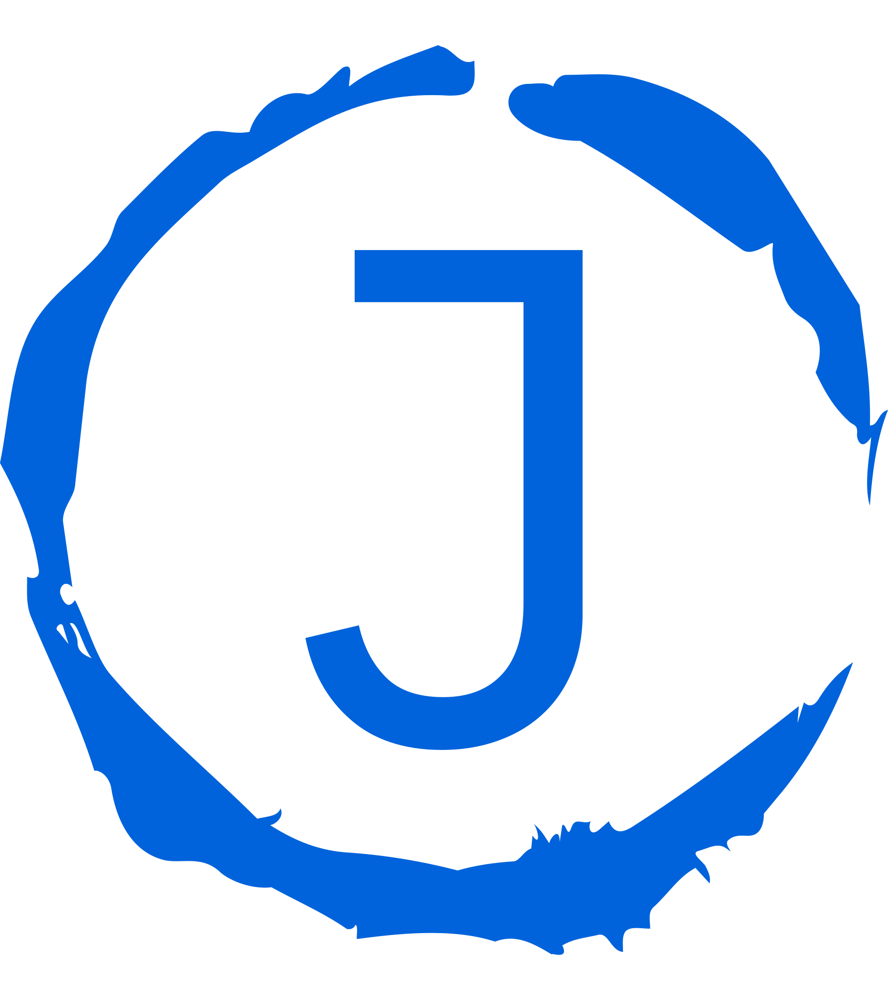

<!-- Improved compatibility of back to top link: See: https://github.com/othneildrew/Best-README-Template/pull/73 -->

<a name="readme-top"></a>

<!--
*** Thanks for checking out the Best-README-Template. If you have a suggestion
*** that would make this better, please fork the repo and create a pull request
*** or simply open an issue with the tag "enhancement".
*** Don't forget to give the project a star!
*** Thanks again! Now go create something AMAZING! :D
-->

<!-- PROJECT SHIELDS -->
<!--
*** I'm using markdown "reference style" links for readability.
*** Reference links are enclosed in brackets [ ] instead of parentheses ( ).
*** See the bottom of this document for the declaration of the reference variables
*** for contributors-url, forks-url, etc. This is an optional, concise syntax you may use.
*** https://www.markdownguide.org/basic-syntax/#reference-style-links
-->

[![Contributors][contributors-shield]][contributors-url]
[![Forks][forks-shield]][forks-url]
[![Stargazers][stars-shield]][stars-url]
[![Issues][issues-shield]][issues-url]
[![LinkedIn][linkedin-shield]][linkedin-url]

<!-- PROJECT LOGO -->
<br />
<div align="center">
  <a href="https://github.com/lgf2111/portfolio">
    
  </a>

<h3 align="center">Portfolio</h3>

  <p align="center">
    This is my portfolio.
    <br />
    <br />
    <a href="https://lgf2111.com">View Website</a>
    ·
    <a href="https://github.com/lgf2111/portfolio/issues">Report Bug</a>
    ·
    <a href="https://github.com/lgf2111/portfolio/issues">Request Feature</a>
  </p>
</div>

<!-- TABLE OF CONTENTS -->
<details>
  <summary>Table of Contents</summary>
  <ol>
    <li>
      <a href="#about-the-project">About The Project</a>
      <ul>
        <li><a href="#built-with">Built With</a></li>
      </ul>
    </li>
    <li>
      <a href="#getting-started">Getting Started</a>
      <ul>
        <li><a href="#prerequisites">Prerequisites</a></li>
        <li><a href="#installation">Installation</a></li>
      </ul>
    </li>
    <li><a href="#contact">Contact</a></li>
    <li><a href="#acknowledgments">Acknowledgments</a></li>
  </ol>
</details>

<!-- ABOUT THE PROJECT -->

## About The Project

[![Product Name Screen Shot][product-screenshot]](https://lgf2111.com)

<p align="right">(<a href="#readme-top">back to top</a>)</p>

### Built With

- 
- 
- 
- 

<p align="right">(<a href="#readme-top">back to top</a>)</p>

<!-- GETTING STARTED -->

## Getting Started

To get a local copy up and running follow these simple example steps.

### Prerequisites

- npm
  ```sh
  npm install npm@latest -g
  ```

### Installation

1. Clone the repo
   ```sh
   git clone https://github.com/lgf2111/portfolio.git
   ```
2. Install NPM packages
   ```sh
   npm install
   ```

### Running

1. Run the server
   ```sh
   npm run dev
   ```

<p align="right">(<a href="#readme-top">back to top</a>)</p>

<!-- CONTACT -->

## Contact

Your Name - [@LeeGuanFeng4](https://twitter.com/LeeGuanFeng4) - lgf2111@gmail.com

Project Link: [https://github.com/lgf2111/portfolio](https://github.com/lgf2111/portfolio)

<p align="right">(<a href="#readme-top">back to top</a>)</p>

<!-- ACKNOWLEDGMENTS -->

## Acknowledgments

- [Adrian Hajdin](https://www.linkedin.com/in/adrianhajdin)

<p align="right">(<a href="#readme-top">back to top</a>)</p>

<!-- MARKDOWN LINKS & IMAGES -->
<!-- https://www.markdownguide.org/basic-syntax/#reference-style-links -->

[contributors-shield]: https://img.shields.io/github/contributors/lgf2111/portfolio.svg?style=for-the-badge
[contributors-url]: https://github.com/lgf2111/portfolio/graphs/contributors
[forks-shield]: https://img.shields.io/github/forks/lgf2111/portfolio.svg?style=for-the-badge
[forks-url]: https://github.com/lgf2111/portfolio/network/members
[stars-shield]: https://img.shields.io/github/stars/lgf2111/portfolio.svg?style=for-the-badge
[stars-url]: https://github.com/lgf2111/portfolio/stargazers
[issues-shield]: https://img.shields.io/github/issues/lgf2111/portfolio.svg?style=for-the-badge
[issues-url]: https://github.com/lgf2111/portfolio/issues
[linkedin-shield]: https://img.shields.io/badge/-LinkedIn-black.svg?style=for-the-badge&logo=linkedin&colorB=555
[linkedin-url]: https://linkedin.com/in/lee-guan-feng
[product-screenshot]: images/screenshot.png
